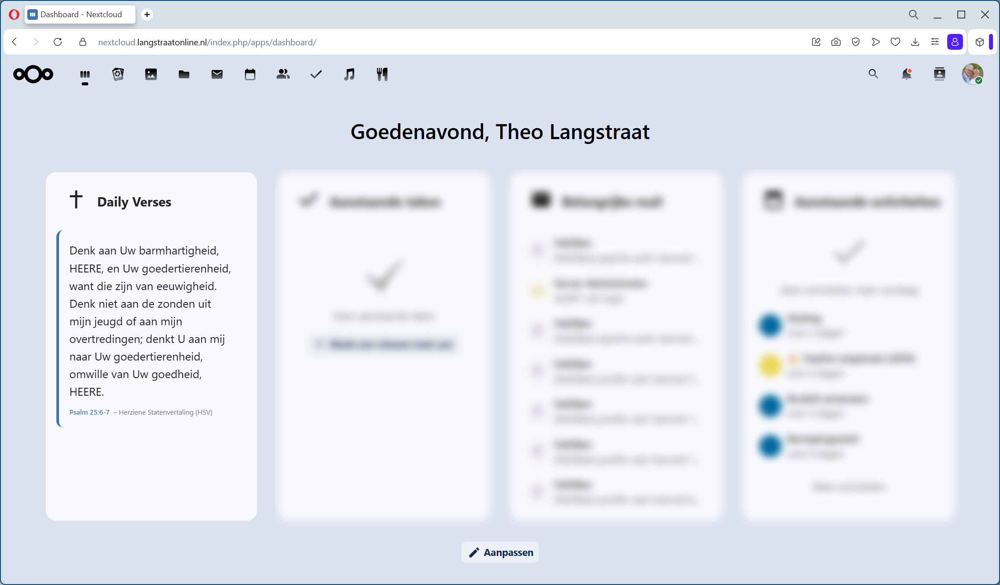
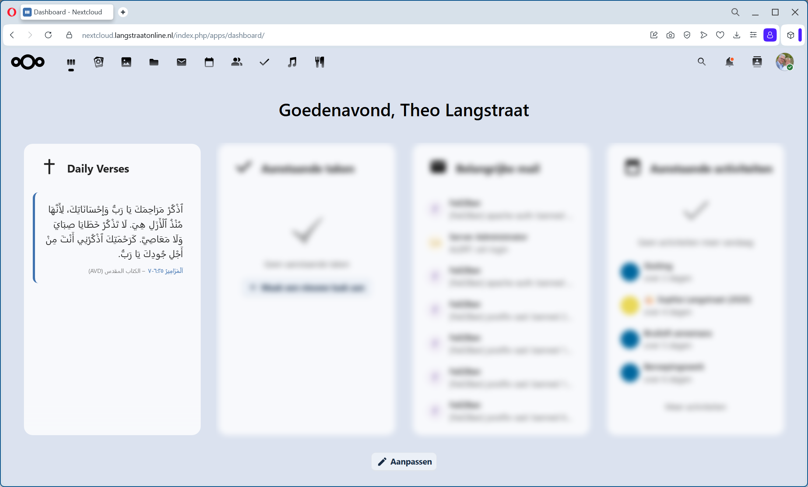
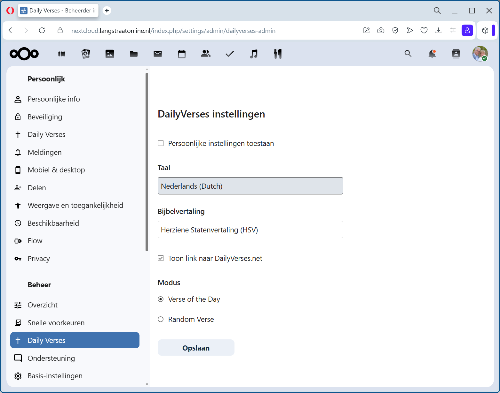
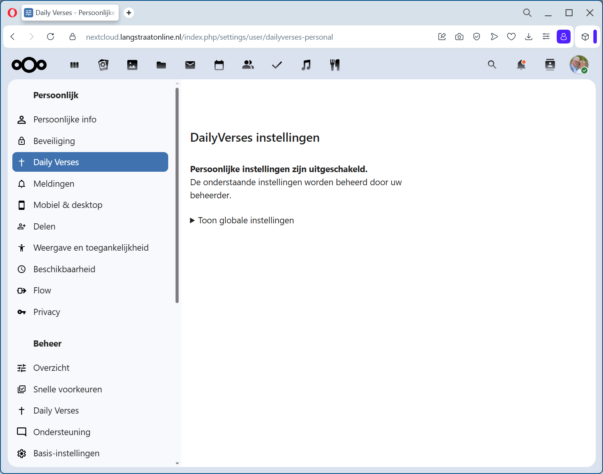
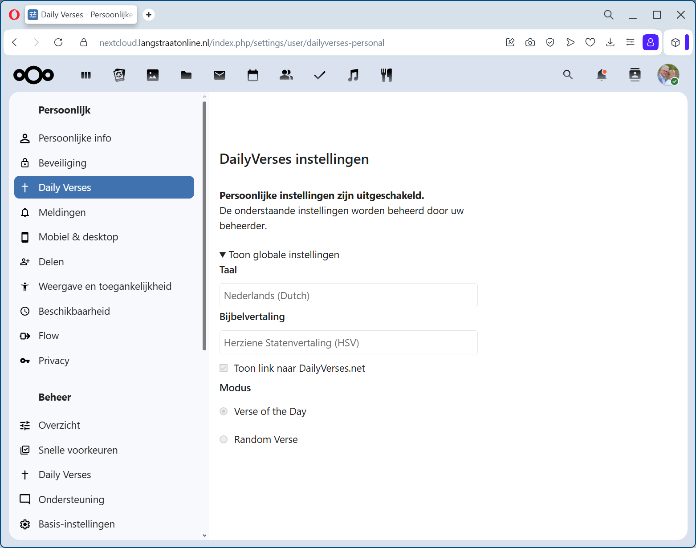

# **Daily Verses for Nextcloud**
Displays a daily or random Bible verse from dailyverses.net on your Nextcloud dashboard, with support for 26 languages and multiple Bible translations.

---

## **Features**
- **Daily or random Bible verse** from dailyverses.net  
- **26 supported languages**  
- **Multiple Bible translations**  
- **Dashboard widget** for quick inspiration  
- **Admin settings** for global defaults  
- **Personal settings** for user‑specific preferences  
- Optional **links to full verse context**  
- Lightweight, fast, and privacy‑friendly (no tracking)

---

## Screenshots


### Frontend


### Frontend Arabic


### Backend – Admin Settings


### Backend – Personal Settings

#### Collapsed (initial view)


#### Expanded (by user)


---

## **Installation**
1. Download or clone the app into your Nextcloud `apps/` directory:  
   ```
   apps/dailyverses
   ```
2. Enable the app in **Settings → Apps → Tools**.
3. Add the **Daily Verses** widget to your dashboard.

---

## **Configuration**

### **Admin Settings**
Admins can configure:
- Default language  
- Default Bible translation  
- Whether verse links should be shown  
- Whether users may override global settings  

Available under:  
**Settings → Administration → Daily Verses**

### **Personal Settings**
Each user can override:
- Language  
- Translation  
- Link visibility  

Available under:  
**Settings → Personal → Daily Verses**

---

## **Dashboard Widget**
The widget displays:
- Today’s verse (or a random verse, if selected)
- Translation and language
- Optional link to dailyverses.net for full context

The widget updates automatically every day. In daily mode, the text is cached for one day.

---

## **Supported Languages**
The app supports 26 languages, including English, Dutch, German, Danish, and more.  
Translations are provided directly by dailyverses.net.

The backend supports the languages ​​German, English, Danish, and Dutch.
